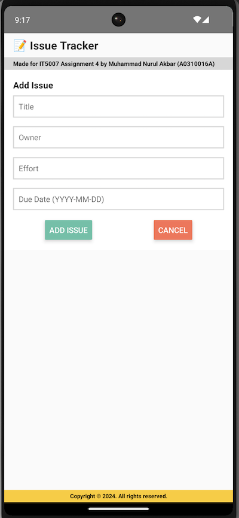

# Assignment 4 Screenshots - Muhammad Nurul Akbar





# React Native (Running this Project)

## Server
Clone the repository into the docker container. Note that the docker container should have port 3000 open. Once you do that, navigate to ReactNativeServer folder. 
- ```npm install```
- ```systemctl start mongod```
- ```npm start``` (optionally, you can use ```screen npm start``` followed by ctrl+d to run the server in the background)

## Client
* No need to clone this repository.
* Copy the files App.js and IssueList.js into the AwesomeProject folder. 
* You will be able to see the changes instantly on the Android emulator (if it was started already).
* You are good to start coding Assignment 5!